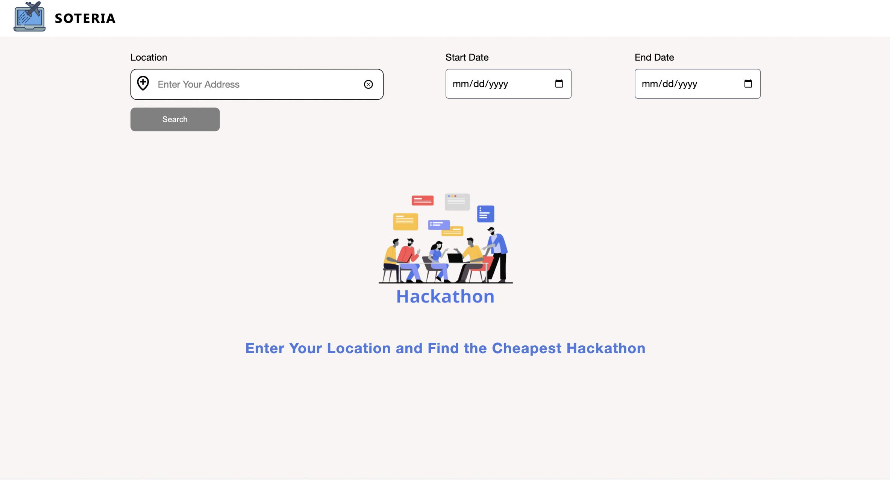

# Soteria

Soteria is a platform that allows hackers to search for hackathons based on the availability of cheap flights, not just in US, but all over the world.

## Inspiration

As big hackathon fans, we always wants to attend hackathons on the west coast and midwest. However, enonomy is a big problem for our students. We always find it difficult to book flights, pick the right prices, and wait for the prices to go lower and this process is especially difficult when there are MULTIPLE hackathons happening at the same time. Now you don't have to worry about this problem because Soteria help you make the best choice.

## Tech Stack

We used NodeJS for backend with ReactJS (NextJS) for front end. We scrapped the data from MLH's events API to get the hackathon data. And We interacted with three APIs to collect all the data we need.

Setup:

-   run `npm i && npm run dev`
-   run `mv next.config.sample.js next.config.js`
-   fill up apikeys in next.config.js
